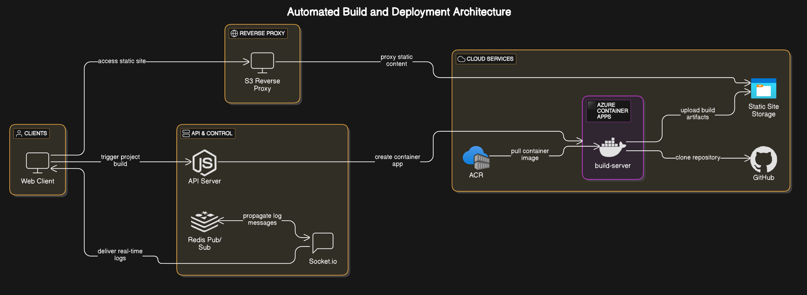

# 🚀 SiteForge

**SiteForge** is a simple platform to build and host static websites — just like Vercel. You connect your GitHub repo, and SiteForge builds your project inside a container and makes it live by hosting the output files (like HTML, CSS, JS).

---

## Architectural Diagram


## ✨ What SiteForge Can Do

- 🔄 Builds your static website from a GitHub link
- 🌍 Hosts and serves the final static files (your website)
- 🐳 Uses containers (Azure Container Apps) to build safely
- 👀 Shows real-time logs while the site is being built
- ☁️ Stores and serves files using Azure Storage + S3-compatible API

---

## 🔧 How It Works (Simple Flow)

1. You paste your GitHub repo link in the web client.
2. The server pulls the repo and triggers a build.
3. The build runs inside an Azure Container App.
4. The built files are uploaded to Azure Blob Storage.
5. The files are served through an S3-compatible proxy (for public access).
6. You get live logs during the build using Redis and Socket.io.

---

## 🧱 Tech Used

- **GitHub** – Source of your website's code
- **Azure Container Apps** – Used to run the build safely
- **Azure Container Registry (ACR)** – Stores the build image
- **Azure Blob Storage** – Stores built static files
- **Node.js + Redis** – For backend server and real-time logging
- **Socket.io** – To stream logs live while building

---

## 🚀 How to Run It

### 1. Clone the Project

```bash
git clone https://github.com/your-org/siteforge.git
cd siteforge
```

### 2. Set Up Azure Resources

You should have the following set up in Azure:
- ✅ Container App for running builds
- ✅ ACR with your custom build image
- ✅ Azure Storage container (public access enabled)
- ✅ Redis (via Azure Cache for Redis or locally)
- ✅ API permissions to pull from GitHub (GitHub PAT in Azure secret if needed)

### 3. Deploy the API Server

The API server is written in Node.js. You can deploy it on:
- Azure App Service
- Azure Container Instance
- Your own VM or server

Make sure the API server:
- Can talk to Redis
- Can invoke Azure Container App builds
- Can upload to Azure Blob Storage

---

## 🌐 Output

Once the build is complete:
- Your static site is uploaded to Azure Blob Storage
- It's served via a public URL using an S3-compatible reverse proxy
- You can access your site instantly

---

## 📁 Project Structure

```
/api-server         → Node.js server to handle builds and uploads
/web-client         → Optional web UI to trigger builds and view logs
/build-server       → Dockerfile for the builder container
```

---

## 📝 License

MIT – Free to use, modify, and share.

---

## 🙌 Credits

Inspired by **Vercel** and **Netlify**, but custom-built with full control using Azure services.
